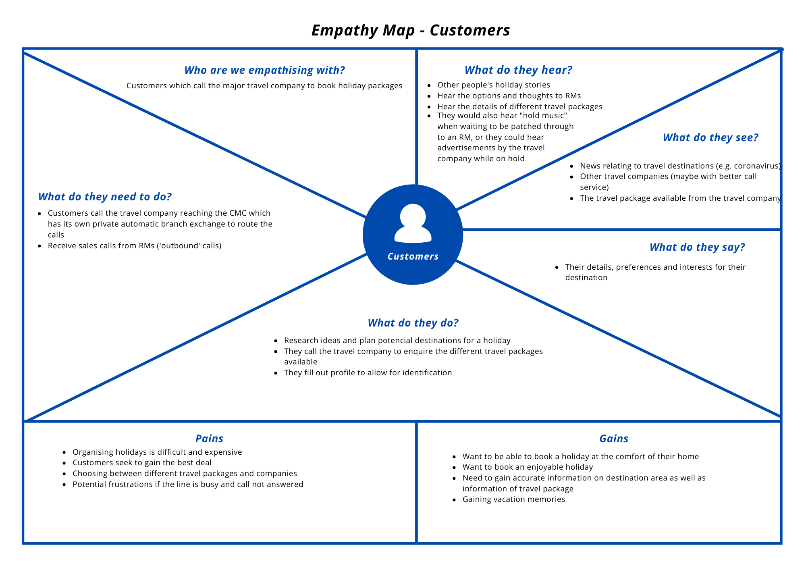
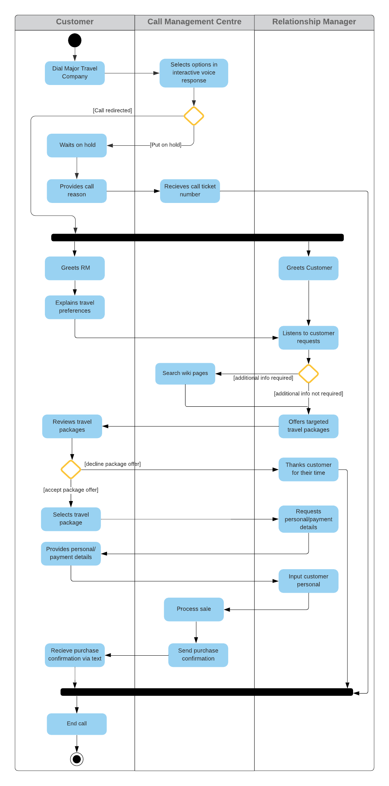

# **31257 Information System Development Methodologies - Project Report**

# Table of Contents *(might not need but it's in the 'Writing Reports.doc')*

# Acknowledgements *(might not need but it's in the 'Writing Reports.doc')*

# Executive Summary

*// SOMEONE MAKE THIS BETTER*

This report presents the definition, analysis, and design of an improved information system solution for the call management centre (CMC) of a major travel company. The Design Thinking principles and agile methodology (Scrum) used are discussed, and iterative progress is documented on GitHub.

# Problem Definition

* The current Call Management Centre provides suboptimal:
  * Waiting times
  * RM to customer matching (mismatch)
  * Prioritisation of customers
  * Inbound call costs
* The Call Management Centre currently provides a suboptimal user experience, due to wait times and poor customer-RM matching, leading to user disatisfaction

## **Objectives**
* Develop an information to improve operation of the Call Management Centre
* Adjust call flow-rate to Relationship Managers
* Improving profitability and customer satisfaction
* Match RMs and end-customers according to RMs skills and customer profiles

## **Assumptions**
 5. List assumptions you have made in the systems analysis.

## **List of Stakeholders**

Stakeholders refer to individuals/entities that have an interest in the development of an information system. The key stakeholders of this project are:

* Customers
* Relationship Managers (RMs)
* Travel Company

## **Point of View (POV) Statements**
> *what happened to our POV statements??*

## **Empathy Maps**

## Empathy Map - Customers

## Empathy Map - Relationship Managers

## Empathy Map - Travel Company

# Design Thinking Approach
*3. Describe your approach from a Design Thinking principles perspective. Your Design Thinking approach to address the problem with artefacts*

## **Ideation**

## Brainstormed Ideas and Reflection

## How Might We (HMW) Statements

## **Agile Methodology - Scrum**
4. Explain the agile methodology, namely, Scrum you have used to carry out the procedure. In your explanation, ensure that you outline activities from Scrum that you use.

# Workproducts and Models
6. Document your proposed workproducts and models *and descriptions*.

## **Activity Diagrams**

## Activity Diagram - Outbound Calls

## Activity Diagram - Inbound Calls

# Potential Advantages and Disadvantages

7. Discuss the competitive advantages might be gained in developing the new information system. Identify and discuss the possible adverse effects for this Business if its information system project fails

## **Competitive Advantage**
*TODO*

## **Possible Effects of Project Failure**
*TODO*

# Conclusion *or* Explanation of each iteration intention, rationale, focus?

8. Document in GitHub all your iteration and models as you progress.

   Recording the intention, rationale, and focus of each system’s development iteration using Github’s commit messages, project boards, and issue tracking capabilities

# References *(might not need but it's in the 'Writing Reports.doc')*
# Appendices *(might not need but it's in the 'Writing Reports.doc')*