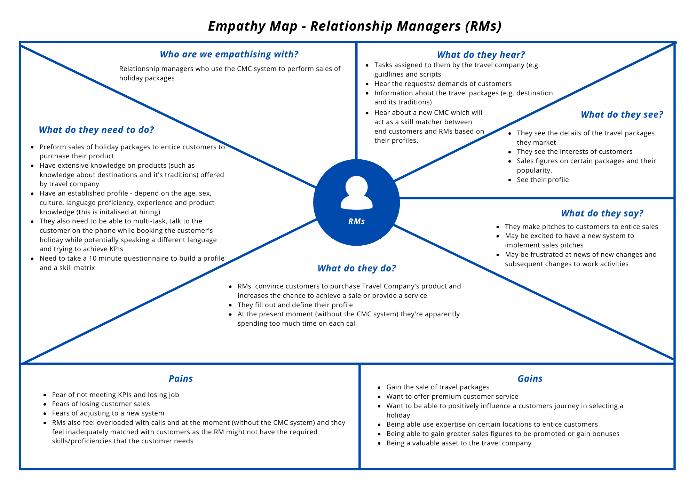

# Information System Development Methodologies Project Report

## 1. Outline the objectives of the project and define the problem 

* *Objectives*
  * Develop an information to improve operation of the Call Management Centre
  * Adjust call flow-rate to Relationship Managers
  * Improving profitability and customer satisfaction
  * Match RMs and end-customers according to RMs skills and customer profiles

* *Problem definition*
  * The current Call Management Centre provides suboptimal:
    * Waiting times
    * RM to customer matching (mismatch)
    * Prioritisation of customers
    * Inbound call costs
  * The Call Management Centre currently provides a suboptimal user experience, due to wait times and poor customer-RM matching, leading to user disatisfaction

## 2. Identify Stakeholders 

#### Travel Company
 * *Who are we empathising with?*
   * A travel company who provides holiday packages  
 * *What do they need to do?*
   * Would like to develop an information system to improve in-house call management centre  (CMC).
   * This CMC system will:
     * Provide improved call routing and dynamic call flow control for both inbound and outbound calls
     * Adjust the call flow rate so that suitable relationship managers (RMs) are matched according to RMs skills and customer profiles 
     * Match customers with informed RMs via profiles 
     * Segment customers into social and cultural segements according to postcodes and surnames - via the "Profiler Tool"
     * CMC system will adjust RMs preformance in selling packages and serving customers effectively and efficiently to rank RMs
 * *What do they see?*
    * They see the packages they have to sell - and the destination
    * They see the customers their targeting
    * The performance of the RMs
    * Sales figures on certain packages 
 * *What do they say?*
    * Customers with the highest scores are served first
    * Calls are directed to RMs based on skill levels and best match
 * *What do they do?*
    * The travel company employs RMs to dial numbers according to a customer target list from a database
    * Repeat customers may have a higher score, customers from particular postcodes may have lower scores
 * *What do they hear?*
    * They hear the feedback of customers 
 * *What do they think and feel?*
    * Fears on losing customer’s based on RMs performance
    * Gain the sale of travel packages 
 
#### Relationship Managers (RMs) 
 * *Who are we empathising with?*
    * Relationship managers 
 * *What do they need to do?*
    * Preform sales of holiday packages to entice customers to purchase their product
    * Have extensive knowledge on products (such as knowledge about destinations and it's traditions) offered by travel company 
    * Have an established profile - depend on the age, sex, culture, language proficiency, experience and product knowledge (this is initalised at hiring) 
 * *What do they see?*
    * See the interests of customers 
    * See the market sales 
    * See travel package details 
 * *What do they say?*
    * They make pitches to customers to entice sales 
    * They fill out and define their profile 
 * *What do they do?*
    * RMs  convince customers to purchase Travel Company's product and increases the chance to achieve a sale or provide a service
 * *What do they hear?*
    * Hear the requests of customers 
 * *What do they think and feel?*
    * Fears of loosing customer sales 
 
#### Customers
 * *Who are we empathising with?*
    * Customers which call the major travel company to book holiday packages 
 * *What do they need to do?*
    * Call the travel company to book travel packages
      * customers dial a number reaching the CMC which has its own private automatic branch exchange to route the calls
 * *What do they see?*
    * The travel package available from the travel company 
 * *What do they say?*
    * Their details, preferences and interests for their destination
 * *What do they do?*
    * Call the travel company 
    * Fill out profile 
 * *What do they hear?*
    * Hear the options and thoughts to RMs
    * The different travel packages
 * *What do they think and feel?*
    * To gain the best deal 
    * Different travel packages
    * Potential frustrations if the line is busy 

### Travel Company Empathy Map

### Relationship Managers Empathy Map

### Customers Empathy Map

## 3. Describe your approach from a Design Thinking principles perspective.

## 4. Explain the agile methodology, namely, Scrum you have used to carry out the procedure. In your explanation, ensure that you outline activities from Scrum that you use.

## 5. List assumptions you have made in the systems analysis.

## 6. Document your proposed workproducts and models.

## 7. Discuss the competitive advantages might be gained in developing the new information system. Identify and discuss the possible adverse effects for this Business if its information system project fails

## 8. Document in GitHub all your iteration and models as you progress.
