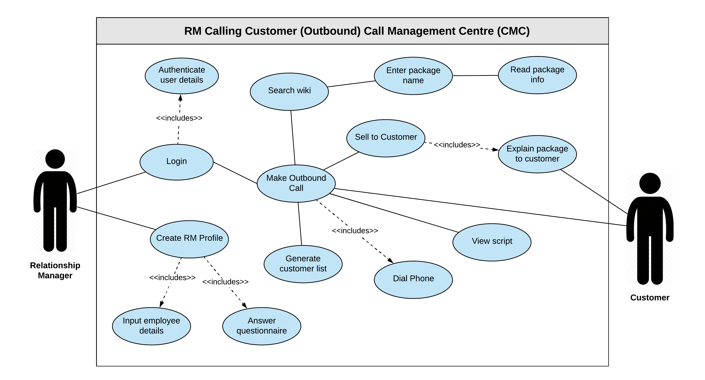
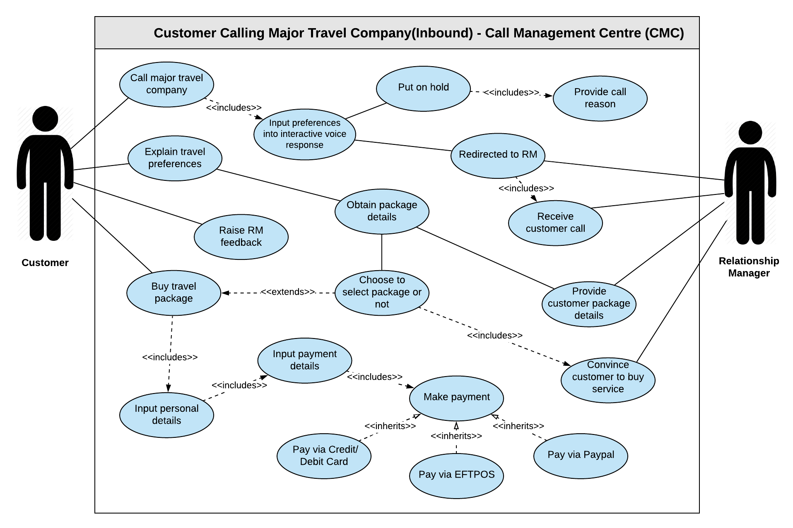
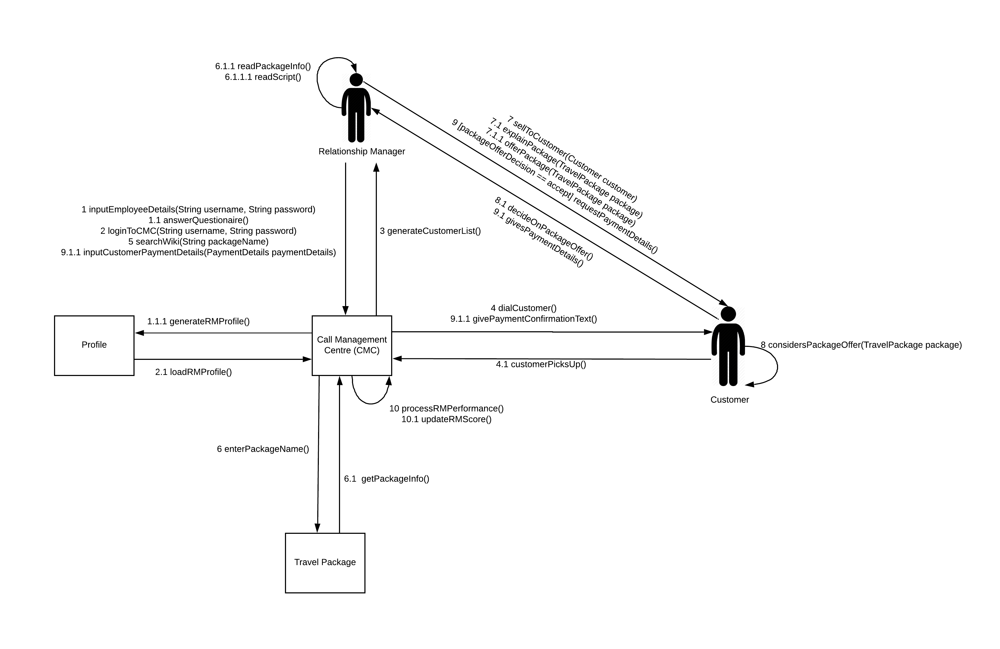
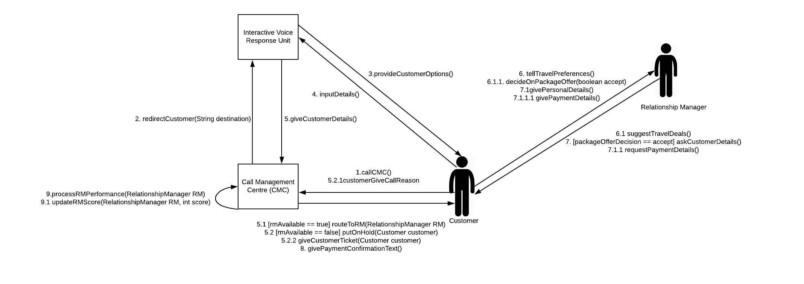

# **31257 Information System Development Methodologies - Project Report**

Table of Contents *(might not need but it's in the 'Writing Reports.doc')*
=================

Acknowledgements *(might not need but it's in the 'Writing Reports.doc')*
================

Executive Summary
=================
*// SOMEONE MAKE THIS BETTER*
This report presents the definition, analysis, and design of an improved information system solution for the call management centre (CMC) of a major travel company. The Design Thinking principles and agile methodology (Scrum) used are discussed, and iterative progress is documented on GitHub. By first defining the problem the team can acquire great insight into the issue at hand and the objectives and milestones to be achieved. Identifying the key stakeholders will allow the team to understand their target audience and collate opinions, ideas and thoughts to further analyse motives and expectations; the Design Thinking principles will aid in framing the team's approach. Assumptions are then made by the team in order to fill in minor gaps and allow fluidity when conducting iterations. Along with documenting assumptions, overall planning is highly important in any project (especially one of technical nature), which is why there are many models and diagrams before implementation. Finally, recognising the competitive advantages that may be gained in developing the new system, helps stakeholders see the ultimate value and goal of what needs to change and grow within their business and why they are even investing in this project.

Problem Definition
==================
* The current Call Management Centre provides suboptimal:
  * Waiting times
  * RM to customer matching (mismatch)
  * Prioritisation of customers
  * Inbound call costs
* The Call Management Centre currently provides a suboptimal user experience, due to wait times and poor customer-RM matching, leading to user disatisfaction

## **Objectives**
* Develop an information to improve operation of the Call Management Centre
* Adjust call flow-rate to Relationship Managers
* Improving profitability and customer satisfaction
* Match RMs and end-customers according to RMs skills and customer profiles

## **Assumptions**
In the duration of this project the following assumption's were considered in all system analysis and feature recommendations. 

* The CMC has enough processing power to handle complex computations and algorithms
* The CMC is already equipped with all data with information such as a customer database with information such as postcode, surnames
* Employee’s within Major Travel Company have appropriate product knowledge and understanding of the operations within the call management centre (CMC).
* The functionality of the inbuilt profiler tool includes customer profile generation and allows the CMC to auto-generate a list of customers for specified Relationship Manager’s (RM’s).
* The details elicited from the RM question includes RM’s age, sex, culture, language proficiency, experience and product knowledge. 
* The CMC autogenerates genetic scripts and guidelines to assist RM sales.
* The current interactive response unit has limited functionality to ensure customer retention with no hold music or ticketing system during peak traffic. 

## **List of Stakeholders**
Stakeholders refer to individuals/entities that have an interest in the development of an information system. The key stakeholders of this project are:

* Customers
* Relationship Managers (RMs)
* Travel Company

## **Point of View (POV) Statements**
### Customers
* Customers calling the travel company need to  have their call answered in a timely manner because current situation has customers waiting on the phone with no RM callback
* Customers speaking to a Relationship Manager need to be  matched with an RM who has the required language proficiency because current situation has customers being inadequately paired with RMs who don’t meet skill/language requirements.
* Customers with little travelling experience need to  call an RM capable of assisting them in finding a package to suit their needs because in the current situation, some customers are finding imperfect packages due to inadequate RM matching

### Travel Company
* Travel Company managing RM staff need to determine which staff members are underperforming in  regards to reaching their KPIs because current situation doesn’t have a system with the capabilities of KPI tracking
* Travel Company managing incoming calls need to manage incoming calls so that no additional call costs impact company budget because the current situation doesn’t have a system which effectively manages incoming calls without causing unforeseen impacts to potential end-users 
* Travel Company managing customer relations need to improve CMC operation and call flow rate because currently, customers are complaining about wait times
* Travel Company managing customer relations need to To profile RMs because RMs are not being matched effectively with customers being served

### Relationship Managers
* Relationship Managers need to serve customers that match their skill set and knowledge because in the current situation, some RMs do not have the required knowledge to best server calling customers
* Relationship Managers need the system to provide guidelines and script for outbound calls to ensure quality best customer service because in the current situation there is not a defined way for how to approach these calls
* Relationship Managers need to have an established profile (depending on the age, sex, culture, language proficiency, experience and product knowledge) because in the current situation, customers are allocated based on RM’s expertise 

## **Empathy Maps**
### Empathy Map - Customers

### Empathy Map - Relationship Managers

### Empathy Map - Travel Company

Design Thinking Approach
========================

## **Approach - Design Thinking**
Design thinking is a non-linear, iterative process which seeks the understanding of users to challenge assumptions, redefine problems and create innovative solutions to prototype and test. This customer-centric approach was undertaken to address the improvements requested by the Major Travel Company for their Call Management Centre (CMC). The design thinking approach undertook consists of the execution of five phases, (1) empathize, (2) define, (3) ideate, (4) prototype and (5) test and by addressing these phases we derived customer-centric innovation. 

### Empathise
Phase one consisted of empathising with stakeholders, this represents anyone who is impacted by the project being developed with a particular focus extended on the end customer. Empathy is a crucial step of achieving a human-centred design process and was utilised to gain insight into users and their needs without introducing any pre imposed bias. When we create solutions, we get better solutions when we think of those who they will affect. To document these perspectives, empathy maps were utilised to collaboratively visualise and share our understanding of stakeholders needs and aid future decision making. This stage allowed us to gain a deeper understanding of the perspective of the users involved and how to shape our solution. 

### Define
Phase two of defining allowed us to synthesise the knowledge obtained in the empathise stage and define the core problems to solve. Here the problem statements were directly derived from creating point of view (POV) statements for all the stakeholders identified. This staged allowed us as a team to consolidate assumptions and agree on features to be developed to solve the problem given. 

### Ideate
Phase three consisted of utilising the user research conducted to ideate solutions to the problem statements we created in the prior stage. The brainstorming and worst possible idea techniques were utilised to assist within our ideation stage. These techniques were chosen to initiate freeform group discussions and simulated creative solutions in light of the problems identified. These sessions consisted of developing “how might we? (HMW)” statements and deriving features relative to the point of view statements developed in the define stage. The conclusions of the brainstormed features were documented in into issues with git. At the conclusion of this stage, the agreed features were converted to issues to be developed for the prototype and testing stage. 

### Prototype/Test
The prototype and subsequent testing phase is representative of the final stages within the design thinking approach. This consists of producing a small-scaled, mock-up of the product or specific features found within the product so that tangible investigations can occur on the solutions generated in the previous stage. To assist in the prototype stage the team designed artefacts representative of the design of the system. The user flows are demonstrated within the use case diagram, activity diagrams, class diagram and collaborative diagrams provided. Due to the nature of this project, the prototype and respective testing are not within scope. 

### Artefacts
Artefact | Description
---|---
Empathy Maps | Is a tool used to visualise user attitudes and behaviours. This map is split into 6 quadrants (Says, Thinks, Does, Feels, Pains and Gains).
POV Statements | Point of view statements are statements which focus on the specific user and their needs. These statements represent the team’s results for the define phase.
How might we? (HMW) | How might we statements represent our results of the ideate phase and are short statements built from point of view statements

## **Brainstormed Ideas and Reflection**
*TODO*

## **How Might We (HMW) Statements**
### End-Customer
* HMW better reach customers who have been on hold for an extended period of time.
* HMW better match customers to RMs so they have a high quality of customer service.
* HMW better match RMs with customers so they can find perfect packages.
* HMW prevent customers from hanging up.
* HMW better communicate with customers to lock down deals within a minimal call time.

### Relationship Managers
* HMW profile RMs, so they are matched effectively to customers served.
* HMW match more knowledgeable RMs to specific customers.
* HMW better allocate customers based on RM expertise

### Travel Company
* HMW monitor KPIs.
* HMW manage incoming calls so that they do not add additional costs to the travel company by occupying human resources (Relationship Managers).

## **Agile Methodology - Scrum**
Scrum is the most widely used agile methodology for software design and development. The framework assumes that requirements and the development process are constantly and unpredictably changing which is often the case in real-world scenarios. While traditional models/approaches (e.g. Waterfall, Spiral) attempt to define all requirements upfront, requirements in agile/scrum are developed, reviewed, and iteratively updated to allow for greater adaptability to changes in client needs/feedback, technological advancements, and other environmental factors (e.g. global pandemics).

### Roles
Scrum teams are self-organising and cross-functional meaning they are independent and trusted to be internally directed. Authority is given to the team to complete work in a manner that the team sees best fit. A number of roles exist in most scrum teams. Due to the nature of this project, the product owner and scrum master also act as members of the development team.

#### Product Owner – Zac
The product owner is an individual responsible for establishing and communicating the product vision including defining and prioritising features to be developed. The product owner must make quick and informed decisions while monitoring project progress and release dates.
#### Scrum Master – Aiswarya
The scrum master facilitates scrum team events and promotes scrum theory, rules, and practices.
#### Development Team - Anastasia, Sanya, Sean
The development team is responsible for building the deliverable increment of a product in each sprint.

### Events/Activities
A sprint is a fixed period of time after which a deliverable iteration of a product must be developed. The following activities were conducted in each of our team's 1-week sprints (Sunday to Friday).

#### Sprint Planning
Our team conducted sprint planning sessions on the first day of each sprint (Sunday). In these meetings we established the goals for the current sprint, and reviewed the stories/issues in the backlog. The tasks for each sprint were allocated to members of the development team and moved from the “Backlog” column (on project board) to the “Ready for Dev” column.
#### Sprint Review
Sprint reviews were held every Friday for members of the development team to explain and deliver their work for the given sprint. The product owner and other team members evaluated what was completed and determined the progress made and tasks left to complete.
#### Sprint Retrospective
Our sprint retrospectives were held after each sprint review to re-evaluate our workflow, communication, and any other issues that arose during the sprint.
#### Daily Scrum
Due to the clashing schedules of our team members, we decided to communicate/conduct daily scrum meetings over text. Each day, progress updates and issues were discussed and any blockers were collectively reviewed and resolved.

### Artefacts
Artefact | Description
---|---
Product Backlog | An ordered list of all tasks/features/stories/requirements for a product (managed by product owner)
Sprint Backlog | A subset of the Product Backlog for development in a sprint (managed by development team)
Product Increment | A potentially shippable version of the product that builds on the previous increment/version
Sprint Burndown Chart | A graphical representation of the development team's progress over time (backlog items completed)

Workproducts and Models
=======================
6. Document your proposed workproducts and models *and descriptions*.

The Collaboration Diagram for Customer emphasises the structure of interactions between the Customer, Relationship manager, Call Management Centre(CMC) and Interactive voice Response unit. The diagram defines the role of each object or actor.  This diagram  follows Customer’s journey from calling the Call Management Centre through to the payment confirmation text for the order.

## **Use Case Diagrams**
Use case diagrams help to visualise the expected behaviour of the interacts between the users (customers), the system and other actions (namely Relationship Managers) and describes system behaviour but not how it will be done. Thus use case diagrams assists us in designing a system from the end user's perspective. The diagrams below show this in regards to outbound and inbound calls respectively:
### Use Case Diagram - Outbound Calls

### Use Case Diagram - Inbound Calls

## **Activity Diagrams**
These diagrams help to visualise the behaviour of the system and actors across multiple use cases, including decisions and the flow of what happens, still not describing the how. The diagrams below show this in regards to outbound and inbound calls respectively:
### Activity Diagram - Outbound Calls

### Activity Diagram - Inbound Calls

## **Class Diagram**
This diagram represents the structure of the classes involved in the wider system. It displays their attributes and methods as well as the relationships that are between them, such as below:

## **Collaboration Diagrams**
These diagrams represents the dynamic behaviour of objects and the structure of the interactions between them. It also displays the sequence of these interactions through numbering; however, focuses more on the messages that flow between each object rather than time-based interactions (seen in sequences diagrams). The diagrams below show this in regards to outbound and inbound calls respectively:
### Collaboration Diagram - Outbound Calls

### Collaboration Diagram - Inbound Calls

Potential Advantages and Disadvantages
======================================
## **Competitive Advantage**
Developing this new information system, if successful, will lead to a plethora of competitive advantages against other major travel companies looking to increase their customer loyalty or retention. Currently, the major travel company involved is in a great position in the market but has some areas that it is lacking in. For example, the CMC (Call Management Centre) has reduced operating efficiency due to call flow control and call routing issues. This leads to some customers having long wait times and drives up the inbound call cost of the CMC. Through the information system, these areas could be improved and provide many advantages.

If the call flow control and routing issues are removed or even lessened through the development of the new information system, then customers will have shorter wait times as well as more effective matches with RMs (Relationship Managers). This increase in user experience will improve customer retention, as they see changes being made in the system for their benefit. In addition, implementing an easier method of feedback elicitation for future, subpar areas could lead to a large uptake in customer loyalty due to their voices being heard and taken into consideration. This will also inadvertently put greater risk on competitors to keep up, which is an extraordinary competitive advantage.

From a more business-centric point of view, not only will the customers be happier with the system, but the travel company will also save costs in handling the soon-to-be larger customer base. The information system's ability to reduce per-call handling time will reduce the cost of inbound calls to the CMC. This, in combination with the increased income that comes with a greater amount of customers, will even further extend the profit of the travel company.

## **Possible Effects of Project Failure**
If the information system is ineffective, lacklustre or fundamentally useless, there are some considerable adverse effects to first take into account. Ranging from the loss of customers, as opposed to sharp gain, to increased operating costs for no benefit, the adverse effects possible should be weighed into consideration alongside the competitive advantages to most accurately see the possible result of the information system.

By implementing what the travel company believes is a solution to their biggest issues, and communicating to users as such, there is an inherent risk if we fail to deliver. By producing a suboptimal solution, customers may feel rightly disappointed, as their expectations were not met. Particularly if these issues have been ongoing for some time, customers who thought the end of these issues were near may be especially upset and cease their interactions with the travel company. Not only does this result in fewer profits for the company, but customers will most likely still need their services met and will hence move to one of the company's direct competitors - a huge competitive disadvantage.

Not only this, but if the system does not work as intended, then the increase in operations (more tasks are performed as a result of the information system) may in fact work against the CMC and slow its efficiency, for little to no reward. This would produce a compounded negative effect, wherein not only is the CMC slower but it is expected to be faster. As such, the lengthened wait times and reduced call flow handling would ultimately lead to greater inbound call costs.

Conclusion *or* Explanation of each iteration intention, rationale, focus?
==========
8. Document in GitHub all your iteration and models as you progress.

Recording the intention, rationale, and focus of each system’s development iteration using Github’s commit messages, project boards, and issue tracking capabilities

References *(might not need but it's in the 'Writing Reports.doc')*
==========

Appendices *(might not need but it's in the 'Writing Reports.doc')*
==========
