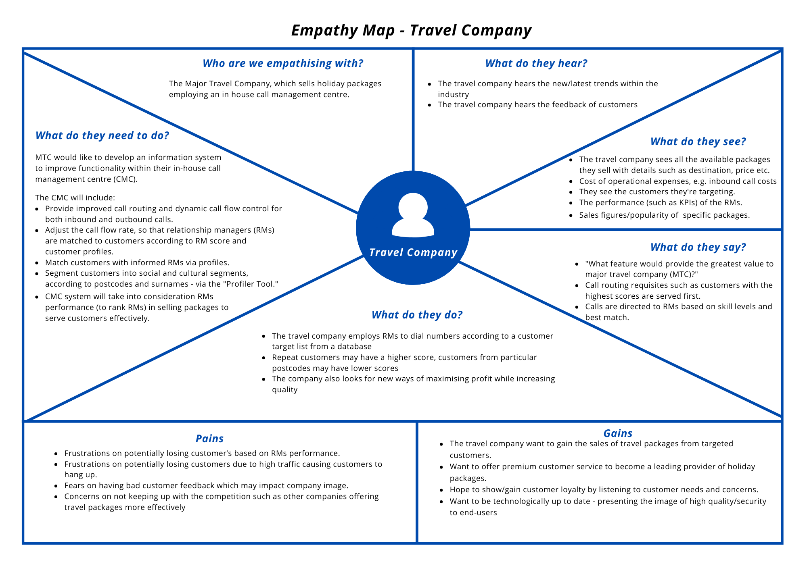
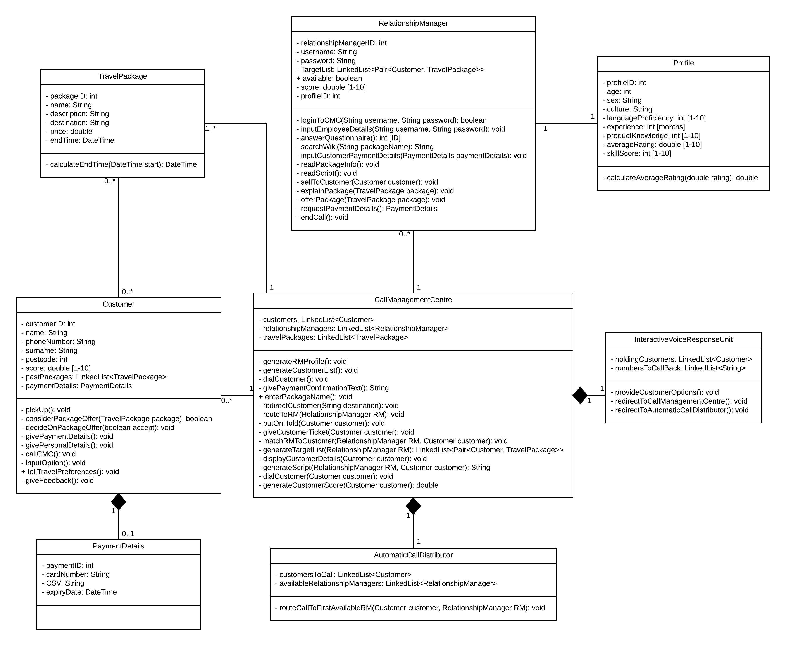

# **31257 Information System Development Methodologies - Project Report**

Table of Contents *(might not need but it's in the 'Writing Reports.doc')*
=================

Acknowledgements *(might not need but it's in the 'Writing Reports.doc')*
================

Executive Summary
=================
*// SOMEONE MAKE THIS BETTER*
This report presents the definition, analysis, and design of an improved information system solution for the call management centre (CMC) of a major travel company. The Design Thinking principles and agile methodology (Scrum) used are discussed, and iterative progress is documented on GitHub.

Problem Definition
==================
* The current Call Management Centre provides suboptimal:
  * Waiting times
  * RM to customer matching (mismatch)
  * Prioritisation of customers
  * Inbound call costs
* The Call Management Centre currently provides a suboptimal user experience, due to wait times and poor customer-RM matching, leading to user disatisfaction

## **Objectives**
* Develop an information to improve operation of the Call Management Centre
* Adjust call flow-rate to Relationship Managers
* Improving profitability and customer satisfaction
* Match RMs and end-customers according to RMs skills and customer profiles

## **Assumptions**
 5. List assumptions you have made in the systems analysis.

## **List of Stakeholders**

Stakeholders refer to individuals/entities that have an interest in the development of an information system. The key stakeholders of this project are:

* Customers
* Relationship Managers (RMs)
* Travel Company

## **Point of View (POV) Statements**

### Customers
* Customers calling the travel company need to  have their call answered in a timely manner because current situation has customers waiting on the phone with no RM callback
* Customers speaking to a Relationship Manager need to be  matched with an RM who has the required language proficiency because current situation has customers being inadequately paired with RMs who don’t meet skill/language requirements.
* Customers with little travelling experience need to  call an RM capable of assisting them in finding a package to suit their needs because in the current situation, some customers are finding imperfect packages due to inadequate RM matching

### Travel Company
* Travel Company managing RM staff need to determine which staff members are underperforming in  regards to reaching their KPIs because current situation doesn’t have a system with the capabilities of KPI tracking
* Travel Company managing incoming calls need to manage incoming calls so that no additional call costs impact company budget because the current situation doesn’t have a system which effectively manages incoming calls without causing unforeseen impacts to potential end-users 
* Travel Company managing customer relations need to improve CMC operation and call flow rate because currently, customers are complaining about wait times
* Travel Company managing customer relations need to To profile RMs because RMs are not being matched effectively with customers being served

### Relationship Managers
* Relationship Managers need to serve customers that match their skill set and knowledge because in the current situation, some RMs do not have the required knowledge to best server calling customers
* Relationship Managers need the system to provide guidelines and script for outbound calls to ensure quality best customer service because in the current situation there is not a defined way for how to approach these calls
* Relationship Managers need to have an established profile (depending on the age, sex, culture, language proficiency, experience and product knowledge) because in the current situation, customers are allocated based on RM’s expertise 

## **Empathy Maps**

### Empathy Map - Customers

### Empathy Map - Relationship Managers

### Empathy Map - Travel Company

Design Thinking Approach
========================
*3. Describe your approach from a Design Thinking principles perspective. Your Design Thinking approach to address the problem with artefacts*

## **Brainstormed Ideas and Reflection**
*TODO*

## **How Might We (HMW) Statements**

### End-Customer
* HMW better reach customers who have been on hold for an extended period of time.
* HMW better match customers to RMs so they have a high quality of customer service.
* HMW better match RMs with customers so they can find perfect packages.
* HMW prevent customers from hanging up.
* HMW better communicate with customers to lock down deals within a minimal call time.

### Relationship Managers
* HMW profile RMs, so they are matched effectively to customers served.
* HMW match more knowledgeable RMs to specific customers.
* HMW better allocate customers based on RM expertise

### Travel Company
* HMW monitor KPIs.
* HMW manage incoming calls so that they do not add additional costs to the travel company by occupying human resources (Relationship Managers).

## **Agile Methodology - Scrum**
4. Explain the agile methodology, namely, Scrum you have used to carry out the procedure. In your explanation, ensure that you outline activities from Scrum that you use.

Workproducts and Models
=======================
6. Document your proposed workproducts and models *and descriptions*.

## **Use Case Diagrams**
*TODO: put in*

## **Activity Diagrams**

### Activity Diagram - Outbound Calls

### Activity Diagram - Inbound Calls

## **Class Diagram**

## **Collaborative Diagrams**
*TODO: put in*

Potential Advantages and Disadvantages
======================================
7. (around 500 words) Discuss the competitive advantages might be gained in developing the new information system. E.g. Potential benefits to the call center (in terms of reducing cost and being able to carry out more effective calls). Identify and discuss the possible adverse effects for this Business if its information system project fails. 

## **Competitive Advantage**
*TODO*

## **Possible Effects of Project Failure**
*TODO*

Conclusion *or* Explanation of each iteration intention, rationale, focus?
==========
8. Document in GitHub all your iteration and models as you progress.

   Recording the intention, rationale, and focus of each system’s development iteration using Github’s commit messages, project boards, and issue tracking capabilities

References *(might not need but it's in the 'Writing Reports.doc')*
==========

Appendices *(might not need but it's in the 'Writing Reports.doc')*
==========